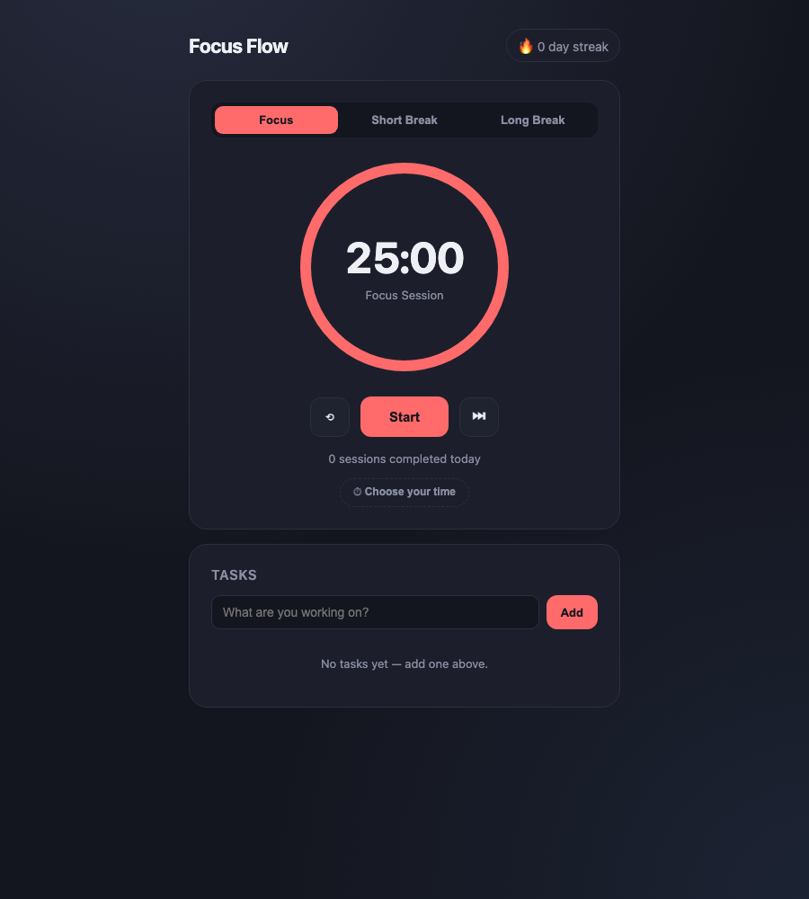

# Focus Flow 🍅

A minimal Pomodoro focus timer with tasks, streaks, and confetti — built as a single self-contained HTML file. No build step, no dependencies, no backend.

**▶ [Try it live](https://jasir7.github.io/focus-flow/)**



## Features

- **Three timer modes** — Focus (default 25 min), Short Break (5 min), and Long Break (15 min), with an animated SVG progress ring
- **Custom focus duration** — the "⏱ Choose your time" button reveals a slider to pick anywhere from 5 to 90 minutes
- **Smart cycling** — after each focus session you're moved to a short break, and every 4th session earns a long break
- **Task list** — add, complete, and delete tasks; click one to make it your active task and it shows in the timer label
- **Streaks & stats** — daily session counter and a day-streak badge, persisted in `localStorage`
- **Celebration** — confetti bursts when you complete a focus session

## Run it locally

It's one file — no install needed:

```sh
open focus-flow/index.html
```

Or serve it:

```sh
npx serve focus-flow
```

## How it's built

Everything (HTML, CSS, JS) lives in [`focus-flow/index.html`](focus-flow/index.html). Plain vanilla JavaScript, CSS custom properties for per-mode theming, and an SVG `stroke-dashoffset` trick for the progress ring. State persists across reloads via `localStorage`.
